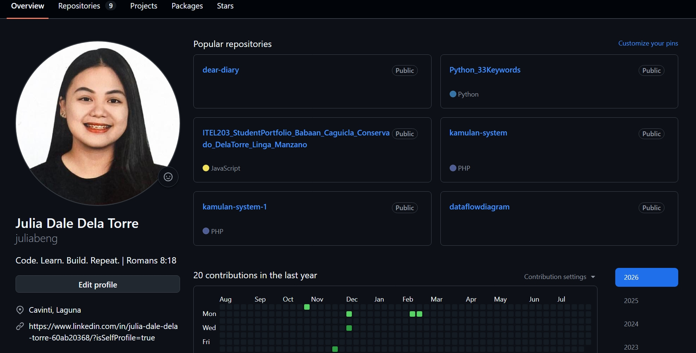
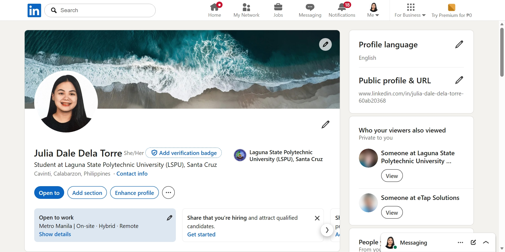
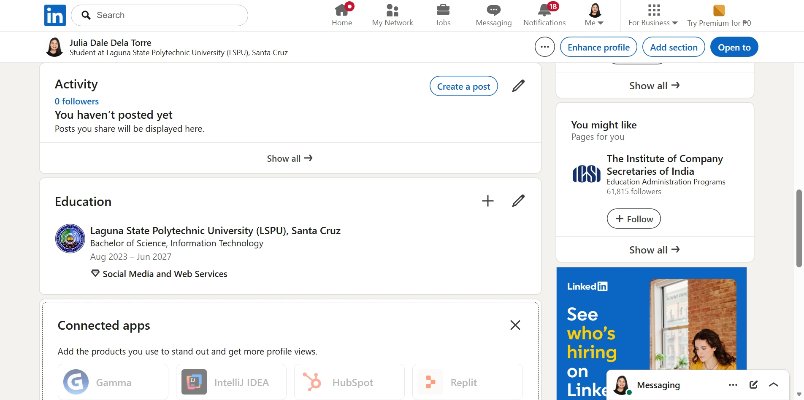

# Week 1 – Building My Professional Environment

## Student Information

- **Name:** Julia Dela Torre
- **Course:** Bachelor of Science in Information Technology (BSIT)
- **Section:** BSIT-4BWAMD
- **Date:** August 08, 2026

---

# Objectives

- To install the software needed for this course.
- To create GitHub and LinkedIn accounts.
- To learn the basic use of Git and GitHub.
- To organize my course files properly.

---

# Software Installed

- Git

---

# Professional Accounts

- **GitHub:** https://github.com/juliabeng
- **LinkedIn:** https://www.linkedin.com/in/julia-dale-dela-torre-60ab20368/?isSelfProfile=true

---

# Installation Screenshots

### GitHub Account

### LinkedIn Profile

---

# Challenges Encountered

### 1. Git could not detect my username and email.
**Solution:** I used the `git config` command to set my GitHub username and email.

### 2. I got a "Repository not found" error when pushing my files.
**Solution:** I checked the repository name and fixed the remote URL because there was an extra hyphen in the repository name.

### 3. My folders did not appear on GitHub.
**Solution:** I learned that Git does not save empty folders, so I added files before committing and pushing them.

---

# Reflection

In this activity, I learned how to prepare my computer for the System Administration and Maintenance course. I installed the required software, created my GitHub and LinkedIn accounts, and learned the basic Git commands such as `git add`, `git commit`, and `git push`.

At first, I experienced some errors while connecting my local repository to GitHub, but I was able to solve them by checking the repository settings and configuring Git correctly. This helped me understand how Git works and why it is important to manage files properly.

I also learned that GitHub is not only used for storing projects but also serves as a portfolio where I can show my work and monitor my progress. LinkedIn is also useful because it allows me to build a professional profile and connect with people in the IT industry.

Overall, this activity improved my understanding of the tools that are commonly used by developers and system administrators. I believe these skills will help me in future laboratory activities, capstone projects, and eventually in my future career as an IT professional.

---

# References

- https://git-scm.com/
- https://docs.github.com/
- https://github.com/
- https://www.linkedin.com/
