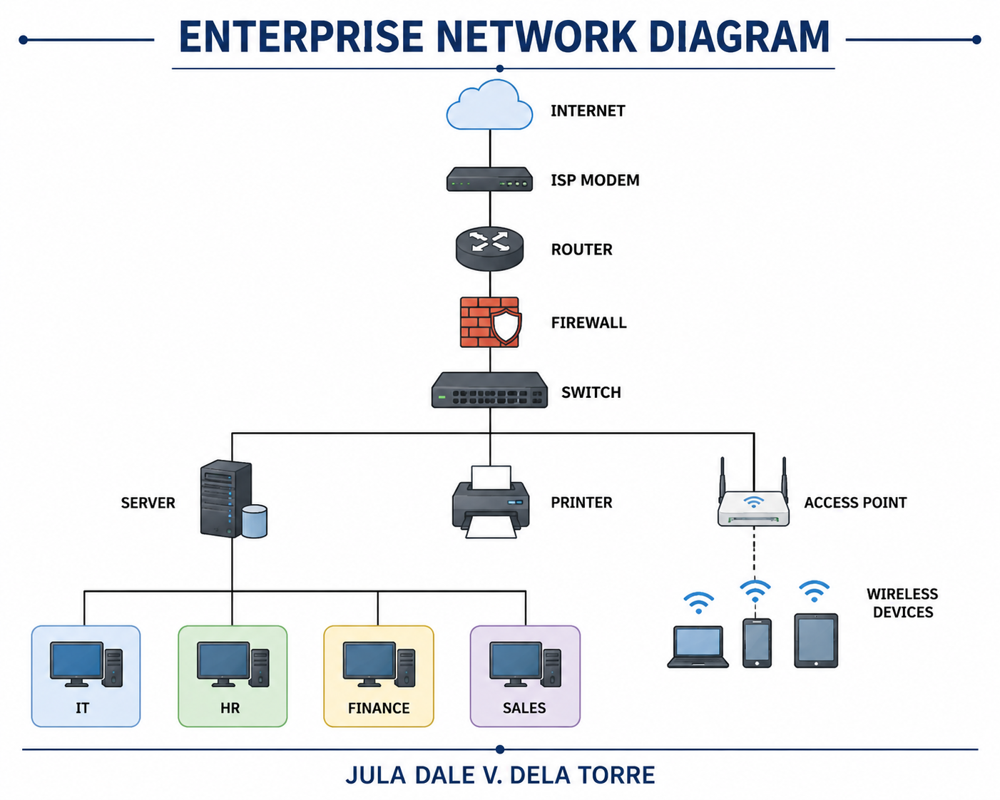

# Week 2 – Enterprise Infrastructure Planning

## Project Overview

This project focuses on creating an initial IT infrastructure plan for **ABC Startup Solutions**, a newly established software development company with 20 employees. The company currently has no computers, servers, network infrastructure, internet infrastructure, or security policies.

As a Junior System Administrator, the goal of this project is to analyze the company's requirements and design an appropriate IT infrastructure before any equipment is purchased or deployed.

The project includes the planning of hardware, software, networking equipment, network topology, system administration roles, infrastructure recommendations, and technical documentation.

---

## Learning Objectives

- Understand the roles and responsibilities of a System Administrator.
- Identify hardware, software, and networking requirements for a small business.
- Analyze organizational IT requirements.
- Prepare professional IT inventories.
- Design an enterprise network topology.
- Create technical documentation using Markdown.
- Practice professional infrastructure planning.
- Develop technical communication and documentation skills.
- Apply critical thinking when selecting IT resources.

---

## Company Scenario

**ABC Startup Solutions** is a newly established software development company located in **Santa Cruz, Laguna, Philippines**.

The company has a single office floor and currently has **20 employees** divided into four departments:

| Department | Number of Employees |
|------------|--------------------|
| Information Technology | 5 |
| Human Resources | 4 |
| Finance | 5 |
| Sales | 6 |
| **Total** | **20** |

The company currently has no computers, server, network, internet infrastructure, or security policies. Therefore, the entire IT infrastructure must be planned and designed from the beginning.

---

## Hardware Inventory Summary

| Asset ID | Hardware | Quantity | Department | Purpose |
|-----------|------------|----------|------------|----------|
| HW-001 | Desktop Computer | 15 | IT, HR, Finance, Sales | Daily office work |
| HW-002 | Laptop | 5 | IT / Management | Mobility and remote work |
| HW-003 | Server | 1 | IT | Centralized services |
| HW-004 | Router | 1 | IT | Internet connectivity |
| HW-005 | Network Switch | 1 | IT | Connect network devices |
| HW-006 | Printer | 2 | HR / Finance | Printing documents |
| HW-007 | UPS | 6 | All Departments | Power protection |
| HW-008 | Wireless Access Point | 2 | Office | Wireless connectivity |
| HW-009 | NAS Storage | 1 | IT | Backup and storage |
| HW-010 | External Backup Drive | 2 | IT | Offline backup |
| HW-011 | Monitor | 20 | All Departments | Workstation display |

---

## Software Inventory Summary

| Software | Version | License | Purpose |
|-----------|-----------|----------|----------|
| Windows 11 Pro | 24H2 | Commercial | Operating system |
| Ubuntu Server | 24.04 LTS | Open Source | Server operating system |
| Microsoft Office | Microsoft 365 | Subscription | Productivity tools |
| Visual Studio Code | Latest | Free | Programming |
| Git | Latest | Open Source | Version control |
| GitHub Desktop | Latest | Free | Repository management |
| VirtualBox | 7.x | Open Source | Virtual machines |
| Google Chrome | Latest | Free | Web browsing |
| Microsoft Defender | Built-in | Included | Antivirus protection |
| AnyDesk | Latest | Free/Commercial | Remote support |
| 7-Zip | Latest | Open Source | File compression |

---

## Network Diagram

The network topology includes:

- Internet
- ISP Modem
- Router
- Firewall
- Switch
- Server
- Printer
- Wireless Access Points
- IT Department
- HR Department
- Finance Department
- Sales Department

### Diagram Preview

```text
Internet
    │
ISP Modem
    │
Router
    │
Firewall
    │
Switch
 ├── Server
 ├── Printer
 ├── Access Point
 ├── IT Department
 ├── HR Department
 ├── Finance Department
 └── Sales Department
```



---

## Technologies Used

- Windows 11 Pro
- Ubuntu Server
- Microsoft 365
- Visual Studio Code
- Git
- GitHub
- GitHub Desktop
- VirtualBox
- Google Chrome
- Microsoft Defender
- AnyDesk
- 7-Zip
- Draw.io / Diagrams.net
- CAT6 Ethernet
- Wireless Access Points
- NAS Storage

---

## Challenges Encountered

One of the most challenging parts of this project was selecting the appropriate hardware, software, and networking equipment for a startup company.

Designing the network topology also required careful planning to ensure that all departments, devices, and network components were properly connected.

This project improved my understanding of infrastructure planning, technical documentation, and network design.

---

## Reflection

This project taught me that planning is an essential part of system administration. Before implementing any technology, a System Administrator must first understand the organization's requirements.

I learned how to identify hardware, software, and network requirements for a small business. I also learned how to create inventories, design network diagrams, and prepare technical documentation using Markdown.

The network diagram was the most challenging task because it required proper understanding of network components and their connections.

Overall, this project improved my skills in planning, networking, documentation, and problem-solving, helping me become a better future System Administrator.

---

## References

- Laguna State Polytechnic University. *ITEP 414 – System Administration and Maintenance: Week 2 Portfolio Project.*
- Microsoft Documentation
- GitHub Documentation
- Cisco Networking Resources
- Draw.io Documentation

---
